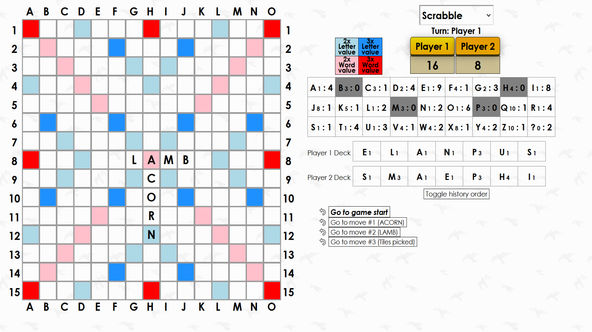

# Scrabble, Connect Four, and Tic-Tac-Toe 

Suite of online board games built using Javascript, ReactJS, and CSS, with a corresponding browser extension for playing quick rounds.

https://board-games-1.netlify.app

## To run locally

In the project directory, use the following commands:

### `npm start`

Runs the app in the development mode.\
Open [http://localhost:3000](http://localhost:3000) to view it in your browser.

### `npm run build`

Builds the app for production to the `build` folder.\
It correctly bundles React in production mode and optimizes the build for the best performance.

### `npm run move`

Moves the files in build/static to static/ for browser extension
